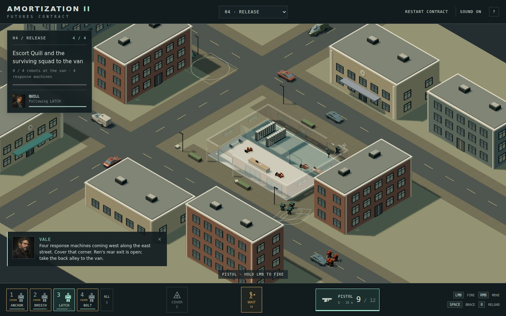

# Release — Ren Quill's second rescue

**04 · Release** follows Handling with the fixed four-pistol squad. Choose it
in either deployment selector, or continue from Handling's debrief. The practice
ranges and their saved heavy loadouts remain available.

Ren inspected the cooperative's operating-rights records at Gannet. His hosts
locked the entrance while requesting a signature for "account reconciliation".
Morrow sends the robots to retrieve him. His first-game liberation remains
intact: he chose this visit twelve years later.

## The block and the withdrawal

Release occupies a **96 × 64 m** city block between two parallel streets and a
cross street. Apartments, a cafe, a clinic and a civic building frame the
junctions. Delivery CARTs use the pavements and self-driving traffic continues
through the streets. Buildings sit on parcels clear of the road corridors.

The **26 × 20 m records office** has a brick facade, a covered street entrance,
reflective breakable windows, a reception counter, archive shelving and a
partitioned back room. Its entrance faces the approach street. The rear staff
door opens onto an alley leading west to a van on the back street. This creates
a route through the office and around the block instead of returning through
the entrance to a loading yard.

| Stage | Player action | Result |
| --- | --- | --- |
| Break the entrance | Shoot the front security lock; seven pistol hits defeat it. | The entrance opens; guards also react to shots through their windows. |
| Clear the office | Fight through reception and the passage on its right. | The rescue ring appears in the archive room. |
| Reach Ren | Bring a living robot within three metres, on his floor with no wall between them. | Ren follows that robot and opens the rear staff door with his fob. |
| Escort to the van | Cover the eastern street corner, withdraw along the rear alley, and gather every survivor at the van. | One uninterrupted second in the recovery ring completes the contract. |

Five seconds after rescue, **four unbraced pistol robots** enter from the east
along the approach street. They can flank around the office if left unchecked.
Putting cover at the eastern corner keeps them away from Ren's rear exit;
leaving the covering robots at the lobby can expose the alley. This is one finite
squad. Killing it is useful but is not an additional extraction requirement.

The roof cuts away before the team reaches the lobby. Its walls, partitions,
roof, window frames and closed doors remain physical during the cutaway. Glass
uses the same breakage, impact sound and scenery reflections as the city kit.
Breaking a pane refreshes both its collider and the camera's cutaway filtering.
Navigation retains the window sills and uses only the authored door passages.

## Escort orders

Ren is an unarmed human with **88 health**, outside the four-robot selection.
His portrait, health and overhead call sign remain when auxiliary labels are
hidden. Enemy pistols, blasts and collisions can hurt him; player pistols keep
the existing friendly-fire policy.

- **H**, the human icon, or a click on Ren: wait or follow the selected guide.
  Selecting a different robot first transfers the guide. In a group, the nearest
  selected robot becomes the new guide if the current guide is not selected.
- **RMB** moves the guide. It slows to Ren's walking pace and waits if he falls
  more than four metres behind. The other robots keep ordinary movement and
  weapon control.
- **C**, then a direction: hold and cover that sector. Moving replaces cover
  orders; **X** ceases fire.
- Ren **stands while captive, waiting or idle** and walks while moving. His
  upright capsule stays the same size. A lost guide leaves him waiting; select
  another survivor and issue H again.

Ren reuses the faceless human skin with charcoal/teal clothing, greying hair and
bronze glasses. The pose formerly called crouching is named **Sitting** in the
model room and is not used in escort gameplay. Damage produces a muted soft
impact without metal sparks. Losing Ren or the whole squad fails the contract.
Morrow reacts to Ren's condition; Rook assesses the returning machines.

## Reuse and inspection

- `src/game/records-office.ts` supplies shared facade openings, the combat shell,
  glazing, navigation walls, front lock and rear portal.
- `src/render/records-office.ts` builds that office kit with a separate roof and
  camera cutaway. It does not depend on Handling's service hall.
- `src/game/escort.ts` authors the city block, furnishings, sites and response.
- `src/game/human-escort.ts` owns following, guide changes and walking pace.
- `src/game/escort-mission.ts` owns entry, guards, rescue, rear-door release,
  response arrival, extraction and failure.
- `src/render/escort.ts` adds doors, furnishings, the support van and active rings.

Development human replays record escort intentions, Ren's pose, health and guide,
rear-door opening, response arrival and the terminal result. Existing dev replay
export and playback support the contract. Restart restores both locked doors,
standing captive Ren, the guards and the reinforcement schedule.

Tests exercise physical entry and shots, partition/roof obstruction, breakable
windows and cutaway handles, rescue access/elevation, guide loss, human damage,
finite reinforcements, interrupted extraction and a complete combat/cover/alley
withdrawal with deterministic replay. Browser QA uses ordinary keyboard/mouse
input through extraction and checks the model-room pose name separately.
