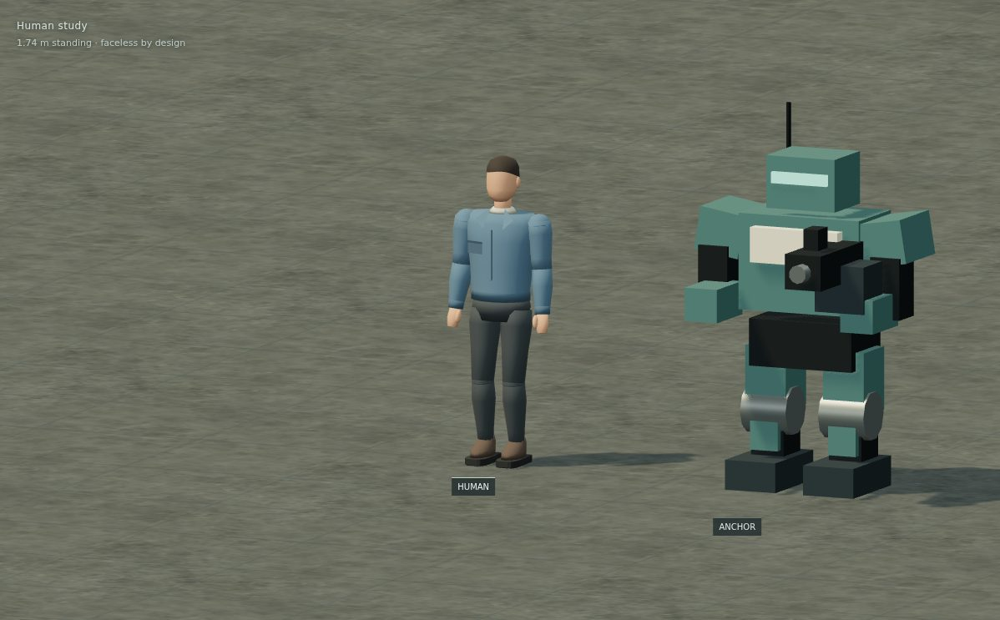

# Faceless humans and the model room

The first human is an ordinary **maintenance worker**, designed from original procedural geometry. They are a visual prototype for civilian and escort characters, not a new squad chassis. Standing height is about **1.74 metres**, with adult proportions, modest shoulders, small hands and a natural head. No external character assets or licenses are needed.

## Direction

Faces are deliberately blank, skin-toned surfaces. Hair, ears, a neck and uncovered hands identify a person without eyes, a mouth, a visor or facial animation. The blank face belongs to the visual language of the game; it is not a mask in the fiction. Conversation can continue to use the existing illustrated portraits.

The worker wears a faded slate-blue jacket over a neutral undershirt, charcoal trousers and enclosed brown work boots. A folded neckline, a subtle pocket, turned hems, cuffs and a quiet centre seam suggest actual clothing. The sleeves are sewn into the jacket surface, and the trousers share a crotch seam. Loose garment volumes and blended bends distinguish the person from PORTER's exposed joints and the squad's armour plates. No glowing panels, armoured shoulders, oversized boots or floating role text are needed to announce a human.

At tactical distance, identity comes from silhouette, colour blocks and movement. The lighter exposed head and hands provide small contrast cues; a narrower body and relaxed arms separate the person from armed robots. The standing, walking and crouching poses allow that distinction to be checked before mission integration. Walking uses a planted stance followed by a forward swing, with heel strike, toe-off and a small foot lift. Knees hinge forward, the calves stay aligned with the shins, and arms counter the stride. The cycle runs in place for comparison. Two-bone leg placement maintains ground contact; crouching brings the knees forward and torso over the feet.

The prefab uses one indexed `SkinnedMesh` and a shared 16-bone skeleton. The jacket and sleeves, pelvis and trouser legs, and each palm and thumb have connected topology; there are no overlapping shoulder caps or separate elbow/knee balls. The collar folds out of the neckline, rather than floating above it. Clothing weights blend across the shoulders, elbows, hips and knees. Trouser cuffs and flexible boot shafts follow the shins; the soles and toe boxes follow the feet. Each boot has a connected sole, closed toe box and ankle upper.

Two small corrective shapes lift and push the shirt hem clear of the thighs. Each front panel responds to its own hip's flexion, with a gentle fade toward the waist and side seams. Walking moves the two sides independently; crouching gathers the front of the shirt above both thighs. The connected surface and its normals deform together, while the sleeves and collar retain their skeletal skinning. This is skeletal cloth deformation with pose correctives, built-in ease and small folds, without cloth simulation.

This is one design study, rather than the final civilian wardrobe. Future variations should keep the same scale and rig, changing clothing colour, hair and practical accessories. Do not add face details simply to make the inspection close-up busier. Future missions still need human movement, reactions and objectives before the model becomes playable.

## Inspect it

Run `npm run dev` and open **`/model-room.html`**, or use **Controls & settings → Model room** in the game's pause menu. The menu link opens a new tab so the paused range stays intact. The same page is included in `npm run build`; it is not restricted to development mode.

| Control | Result |
| --- | --- |
| Left drag | Orbit the models |
| Wheel | Zoom |
| Right drag / middle drag | Pan |
| Frame cast | Fit the selected lineup |
| Focus human | Inspect the worker at a three-quarter angle |
| Front / Back | Compare silhouettes in elevation |
| Isometric | Use the game's equal-axis, 120° projection |
| Tactical scale | Use Handling's actual default camera framing |
| Standing / Walking / Crouching | Change the human pose; the walk can be paused |
| Cast checkboxes | Add or remove squad, civilian and traffic models |
| Name plates / Metre grid | Hide inspection overlays |

The human stays in the lineup. ANCHOR, ROOK and PORTER are shown by default. NEEDLE, CART, CRATE, KITE, WATCH, CAB and VAN can also be selected. Every model retains its original dimensions; fitting the camera never rescales a character. The aircraft are grounded for dimensional comparison. The squad holds its primary weapon, with NEEDLE's pistol and deployed bipod hidden.

## Reuse

- `src/render/humans.ts`: standalone `makeHuman()` prefab, pose updater and resource disposal. Forward is +Z; the floor is Y=0. It has no gameplay or physics dependencies.
- `src/render/human-surface.ts`: indexed surface builder for sewn openings, curved branches, material groups and skin weights. Adjacent garment panels reuse vertices so the skeleton deforms a continuous surface.
- `src/render/actor-model.ts`: the articulated military and WATCH geometry used by both the combat renderer and the model room. Combat's indicators and effects remain in `RangeScene`.
- `src/render/model-room-cast.ts`: comparison metadata and frozen instances of the production civilian/traffic fleets. A private port fixture supplies their source data and frees its physics world after construction. No simulation, sound or AI runs in the viewer.
- `src/model-room.ts`: independent orbitable Three.js page, sharing game materials and camera constants, with optional name plates and a one-metre grid.

`window.amortization2ModelRoom.inspect()` exposes read-only camera, pose, animation time, hem correction weights, selection, bounds and render information for browser QA. The room does not change campaign progress, controls, squad selection or saved game preferences.
