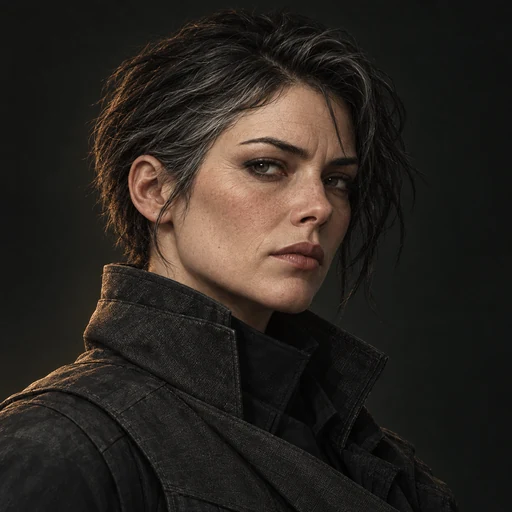
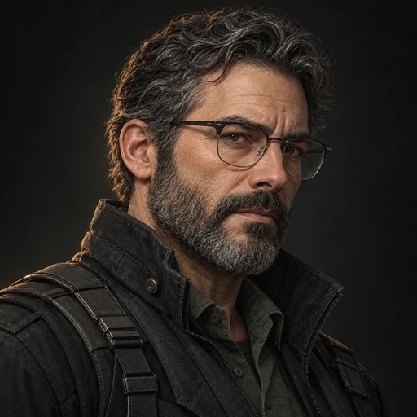
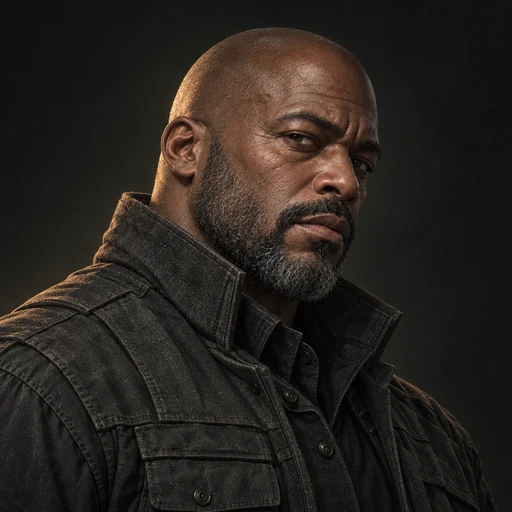
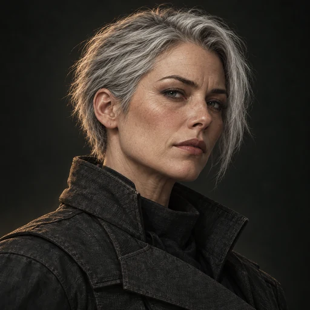
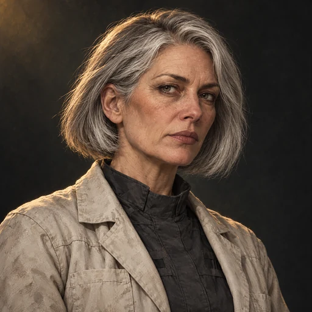
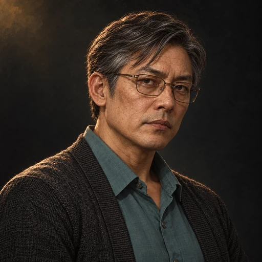

# Friendly human cast

The returning cast has aged **twelve years**. Morrow, Vale, Rook and Sable retain
their first-game identities while moving into operations and support for the
robots. Iona Voss and Ren Quill have independent, useful jobs after their rescue.
The roles below guide future mission writing and presentation.

| Person | Responsibility | Principal presence | Portrait |
| --- | --- | --- | --- |
| Morrow | Operations; original field lead | Clients, briefings, changed assignments and debriefs | [morrow.webp](../public/portraits/morrow.webp) |
| Vale | Systems and reliable information | Calibration, meaningful technical exceptions and recovered records | [vale.webp](../public/portraits/vale.webp) |
| Rook | Weapons, preparation and field security | Range, workshop, loadout preparation and selected live operations | [rook.webp](../public/portraits/rook.webp) |
| Sable | Reconnaissance and local relationships | District briefings, sourced observations, contacts and recovery arrangements | [sable.webp](../public/portraits/sable.webp) |
| Iona Voss | Engineering programme and structural limits | Primarily workshop cutscenes | [voss.webp](../public/portraits/voss.webp) |
| Ren Quill | Agreements and durable outcomes | Primarily client and coalition cutscenes | [quill.webp](../public/portraits/quill.webp) |

| Morrow | Vale | Rook |
| --- | --- | --- |
|  |  |  |
| Sable | Iona Voss | Ren Quill |
|  |  |  |

## Morrow — operations

Morrow introduces the client, defines the accepted assignment and handles changes
to it. Reinforcements, an unsafe recovery route or a request outside the agreement
belong to her. Briefings establish concrete priorities:

> We are here to get their trucks moving. Take the loading yard. The offices can wait.

She also owns the debrief: who got out, what remains unresolved and what the crew
committed to next. Show her in the forward command vehicle and meeting clients,
occasionally entering a district once the machines secure it. She remains a field
lead with practical experience rather than a distant mission dispenser.

Initially she personally settles every disagreement. As the outfit grows she
must trust other people to make decisions and learn to exercise authority without
making everyone dependent on her permission. The finale gives her enough power
to make that choice consequential.

Visual continuity: short dark hair, distinctive brows and face, a charcoal high
collar. Twelve years show through restrained greying, eye and forehead lines,
and a mature expression. She remains active and capable.

## Vale — systems

Vale maintains calibration, communication, onboard behaviour and trustworthy
recordings. Early range work introduces him through the actual machines. Later
reports concern meaningful exceptions, unreliable information and traced orders;
routine readiness remains visible feedback.

> The sight is steady. The chassis is still settling.

He initially trusts good records to protect the crew. Selectively presented
footage then turns an intervention into a justification for seizure. He learns
to establish context and responsibility with witnesses and Quill. Show him
inspecting recovered units, connecting independent local systems and listening
to workers whose accounts contradict the official report.

Visual continuity: dark curly hair, glasses, beard and a black utility jacket.
Preserve his face and eyewear; add twelve years of grey in hair and beard and
natural changes around eyes, cheeks and forehead.

## Rook — weapons and security

Rook introduces weapons and configurations at the range, supervises mounts and
combat preparation, and assesses firing lanes, advances and withdrawal routes.
The sniper, additional machinegunner and twin-minigun options belong at his bench.

> Make them give up the corner. Then keep it.

During selected operations he reports a developing crossfire or takes
responsibility for the support vehicle's security. He examines what comes home:
a successful return can end with a silent inspection of a battered chassis
before he asks what happened. His restraint matters as much as his expertise.

The ROOK chassis shares his callsign because its doctrine came from him.
In live dialogue the machine is "the heavy" or "the ROOK unit"; the named
speaker portrait identifies the human. Neither is an uploaded copy of the other.
His pride is clearest when someone uses the machine well.

Visual continuity: Black man, broad build, shaved head, short beard and the
original facial structure. Age his skin and beard by twelve years while retaining
his physical presence. Work clothing remains substantial charcoal fabric.

## Sable — reconnaissance and contacts

Sable provides the district's local picture. She walks streets, watches changes
of shift and speaks to people. Her reports interpret visible activity and have
sources and boundaries:

> The blue van belongs here. Those two behind it do not.

She identifies an approaching recovery convoy or workers in a supposedly empty
building. If she loses sight of something she says so. The first mechanic she
introduces can later supply a workshop; a dispatcher can arrange an extraction;
a shopkeeper can remember an earlier intervention. Districts accumulate
relationships through her.

Her arc grows from recon specialist into someone building a network that can
survive without a central corporate operator. By the end people bring her
information before she asks. She returns from fieldwork with weather on her coat
and details that were absent from the brief.

Visual continuity: the same face and short asymmetric silver hair. Her hair was
already silver in the original; ageing must also appear in facial and neck
structure, skin texture and lines. Preserve her alert expression.

## Iona Voss — engineering

Voss develops major modifications, investigates failures and judges what can
safely return to service. Vale maintains behaviour and electronics; Rook handles
weapons and combat preparation; Voss understands structural limits across the
whole machine. She works with technicians and produces useful results, including
unwelcome conclusions. Repairs and capabilities have time, parts and explanations
behind them.

> You brought it back. Now we can fix it.

Keep her primarily in workshop scenes. The person once confined to a workplace
now chooses what it builds. Her independence is a visible consequence of the
first game.

Visual continuity: silver-grey side-parted bob, original face, light work/lab coat
over a dark shirt. Add twelve years of ageing and more white in the hair. Her
portrait remains the engineer's own identity, not a generic elderly scientist.

## Ren Quill — agreements

Quill examines claims, protects clients from predatory terms and assembles the
coalition's mutual guarantees. His work determines who can use a recovered depot
the following morning. Show him meeting clients and presenting completed work.

> You reopened the road. I have made it harder for them to close it again.

Keep him primarily in cutscenes. His arc moves from an auditor able to object to
wrongdoing into someone able to construct a workable alternative. The coalition
depends on arrangements he has spent the campaign building.

Visual continuity: Ren is the East Asian man from the corrected first-game
portrait, with side-parted dark hair, bronze glasses, teal shirt and charcoal
cardigan. Age that specific face by twelve years. The unused right-hand woman
in the original witness atlas is not Ren and must not be used as his reference.

## Familiarity over the campaign

1. At the range, Rook prepares the robots and Vale checks their systems. Familiar
   work establishes their relationship.
2. On the first port deployment, Morrow owns the assignment and Sable the local
   picture. The player learns which information belongs to whom.
3. Voss examines the first difficult return; Quill subsequently exposes the wider
   claim behind the incident.
4. Recurring clients begin addressing specific team members. Responsibilities
   become relationships, and successful work changes later access and support.
5. The final operations involve the whole team contributing in its own domain,
   with Morrow trusting decisions made without her immediate permission.

Use a few recurring places: operations vehicle, range, workshop, client meetings
and returning districts. Rook has his bench; Vale repairs the same terminal;
Sable comes back with observations; Morrow checks the support crew as well as the
machines. Most missions need one briefing owner and one principal live contact.
When Rook interrupts Sable's report, something has reached the support vehicle.

All names, roles and dialogue are selectable UI text rather than baked into
portraits. Individual assets are prepared for future comms and scene use; the
current prototype has no campaign dialogue player. See [story artwork](story-art.md)
for image provenance, prompts, file specifications and integration guidance.
